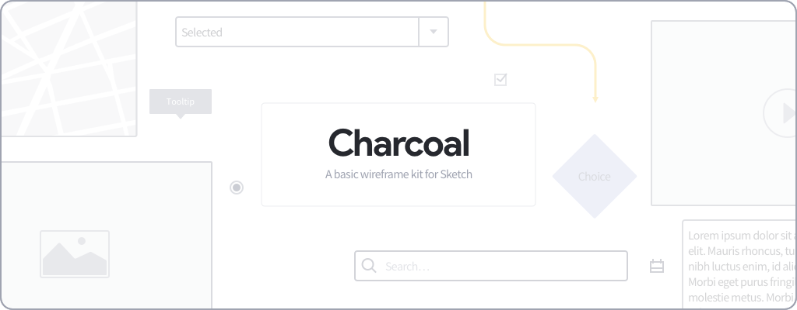

# Charcoal: a basic wireframe kit for Sketch
Charcoal is a basic wireframe kit created for Sketch. The main purpose of Charcoal is to provide some usefull components out of the box for designing web or mobile app.

## Setup & usage
1. Clone or download this repo
2. Download and install the font used in the library: [Source Sans Pro](https://fonts.google.com/specimen/Source+Sans+Pro)
3. Add `Charcoal.sketch` as a library: `File > Add as library…`

## Missing something?
Can't find what you need? You can add it yourself and contribute to the library, or tell me what you would like to add.

## Author

### Jacopo Rabolini
I am a UX / UI Designer who lives and works in Italy. You can find more information about me at the following links:

- Web site: [www.jacoporabolini.com](http://www.jacoporabolini.com)
- Linkedin: [linkedin.com/in/jacopo-rabolini/](https://www.linkedin.com/in/jacopo-rabolini/)
- Dribble: [https://dribbble.com/JacopoRabolini](https://dribbble.com/JacopoRabolini)
- Behance: [https://www.behance.net/jacoporabolini](https://www.behance.net/jacoporabolini)

## License
Charcoal is released under [MIT License](./license.md).
